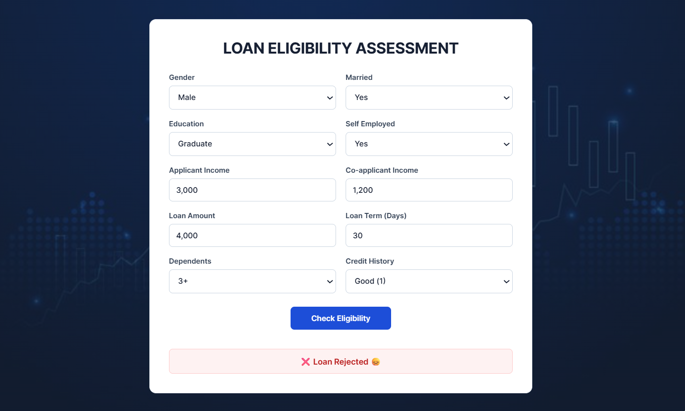

Loan Eligibility Prediction System

A machine learning-powered web application that predicts whether a loan application is likely to be Approved or Rejected based on applicant information.

The project combines a trained machine learning model with a Flask backend and a responsive HTML, CSS, and JavaScript interface. Users can enter applicant details through the web interface and receive a prediction from the trained model.

PROJECT OVERVIEW

Loan approval decisions can depend on multiple applicant characteristics, including income, credit history, loan amount, employment status, and other demographic information.

This project demonstrates how machine learning can be integrated into a web application to process these applicant features and generate a loan eligibility prediction.

The application was developed as a machine learning and web development project for educational and demonstration purposes.

FEATURES

1. Loan eligibility prediction
2. Machine learning-based classification
3. Flask REST API backend
4. Interactive web interface
5. Applicant information form
6. Automatic prediction processing
7. Approval and rejection result display
8. Responsive user interface
9. Professional form design
10. Local background image
11. Trained machine learning model included
    
TECHNOLOGIES USED
Machine Learning:
1. Python
2. Scikit-learn
3. LightGBM
4. NumPy
5. SciPy
6. Joblib

BACKEND:
1. Flask
2. Flask-CORS

FRONTEND:
1. HTML5
2. CSS3
3. JavaScript

DEVELOPMENT TOOLS:
1. Jupyter Notebook
2. Visual Studio Code
3. Git
4. GitHub

PREDICTION PROCESS
1. The user enters their loan application information.
2. The web interface sends the information to the Flask backend.
3. The backend processes and encodes the input features.
4. The processed features are passed to the trained machine learning model.
5. The model generates a prediction.
6. The Flask backend returns the prediction.
7. The result is displayed on the web interface.

INPUT FEATURES
The application uses applicant information such as;
1. Gender
2. Marital Status
3. Number of Dependents
4. Education
5. Self-Employment Status
6. Applicant Income
7. Co-Applicant Income
8. Loan Amount
9. Loan Term
10. Credit History

These features are processed by the Flask backend before being passed to the trained model.

SCREENSHOT

INSTALLATION AND SETUP
 1. Clone the repository
'''bash
git clone https://github.com/SadiiqA3/Loan-Eligibility-Prediction.git

Navigate into the project:

'''bash
cd Loan-Eligibility-Prediction

 2. Create a Virtual Environment
Windows:
'''powershell
python -m venv venv

Activate the environment:
'''powershell
.\venv\Scripts\Activate.ps1

3. Install Dependencies
'''bash
pip install -r requirements.txt

4. Run the Application
Navigate to the application directory:
'''powershell
cd App

Start the Flask server:
'''powershell
python app.py

5. Open the Application
Once Flask starts, open the following address in your browser:
http://127.0.0.1:5000/

The loan eligibility prediction interface should then appear.

MACHINE LEARNING MODEL

The trained model is stored in:

App/LightGBM.pkl

The model receives the processed applicant features and generates a binary prediction representing the loan eligibility result.

The model is loaded by the Flask backend using Joblib and used during prediction requests.

API ENDPOINT

The Flask application exposes a prediction endpoint:

POST/predict

The endpoint receives applicant information in JSON format, processes the data, and returns the prediction.

Example response:

'''json
{
  "prediction": "Approved"
}

or:

'''json
{
  "prediction": "Rejected"
}

REQUIREMENTS
The main Python dependencies used by the project include: Flask,Flask-CORS,Joblib,LightGBM,NumPy,Scikit-learn etc.

EDUCATIONAL PURPOSE

This project demonstrates the integration of:

1.Machine learning
2.Data preprocessing
3.Model inference
4.Flask API development
5.Frontend development
6.Git and GitHub version control
It provides an example of how a trained machine learning model can be integrated into a functional web application.

DISCLAIMER
This project is intended for "EDUCATIONAL AND DEMONSTRATION PURPOSE ONLY"
Predictions generated by this application should not be considered professional financial, lending, or credit advice. Real-world lending decisions involve additional factors, regulatory requirements, verification processes, and human or institutional review.

Author

ABUBAKAR ABDULLAHI ABUBAKAR

GitHub: [SadiiqA3](https://github.com/SadiiqA3)
